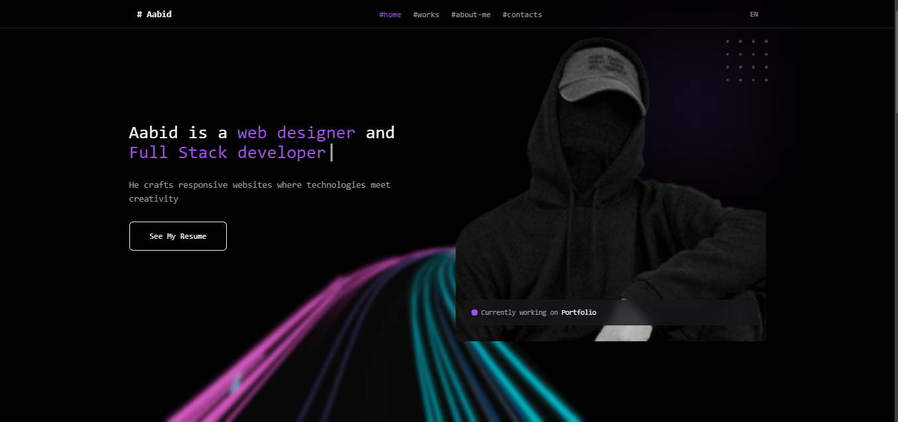

  

## 💫 About Me:  
- 🚀 Tech enthusiast & software developer  
- 👨‍💻 Working on ML projects, automation scripts, & AI tools  
- 🔍 Passionate about data analysis, trading algorithms, & building cool tech  
- 🌟 Love exploring new technologies & creating impactful solutions  

--- 

## 🔗 🌐 Socials:  

  
  
  
  

---

💻 Tech Stack:  

---

## 📊 GitHub Stats:
  
  

---
### 📊 Leetcode Stats

## 🏆 GitHub Trophies
- 

## ✍️ Random Dev Quote  

<!--
**aabid2947/aabid2947** is a ✨ _special_ ✨ repository because its `README.md` (this file) appears on your GitHub profile.

Here are some ideas to get you started:

- 🔭 I’m currently working on ...
- 🌱 I’m currently learning ...
- 👯 I’m looking to collaborate on ...
- 🤔 I’m looking for help with ...
- 💬 Ask me about ...
- 📫 How to reach me: ...
- 😄 Pronouns: ...
- ⚡ Fun fact: ...
-->
